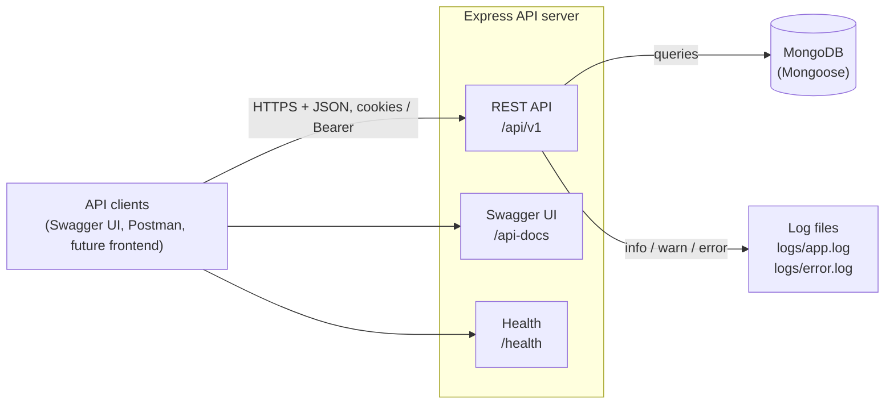
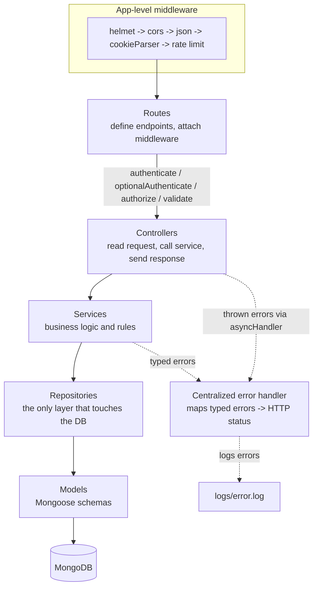
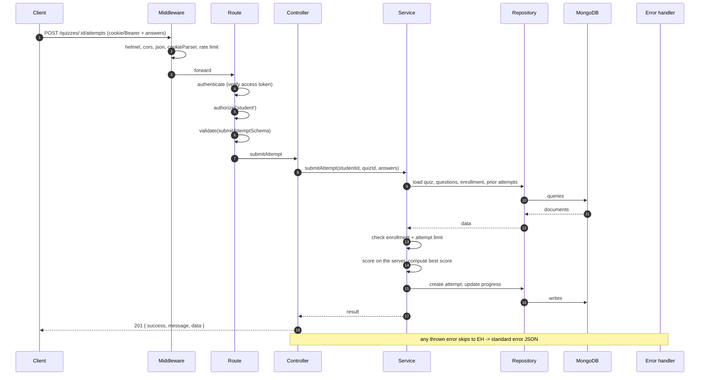
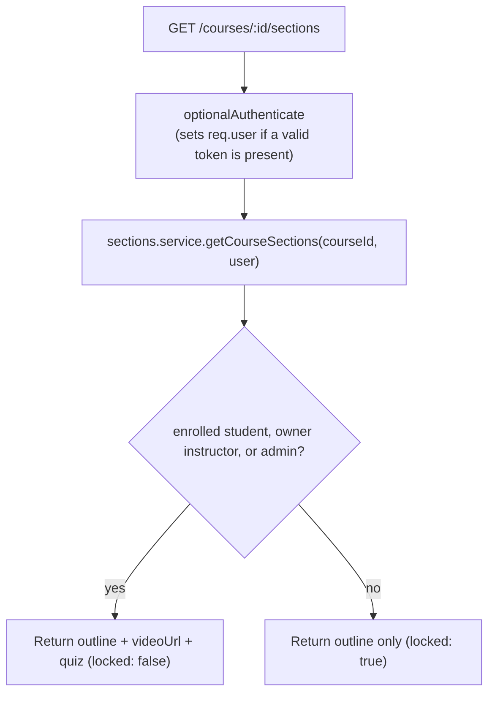
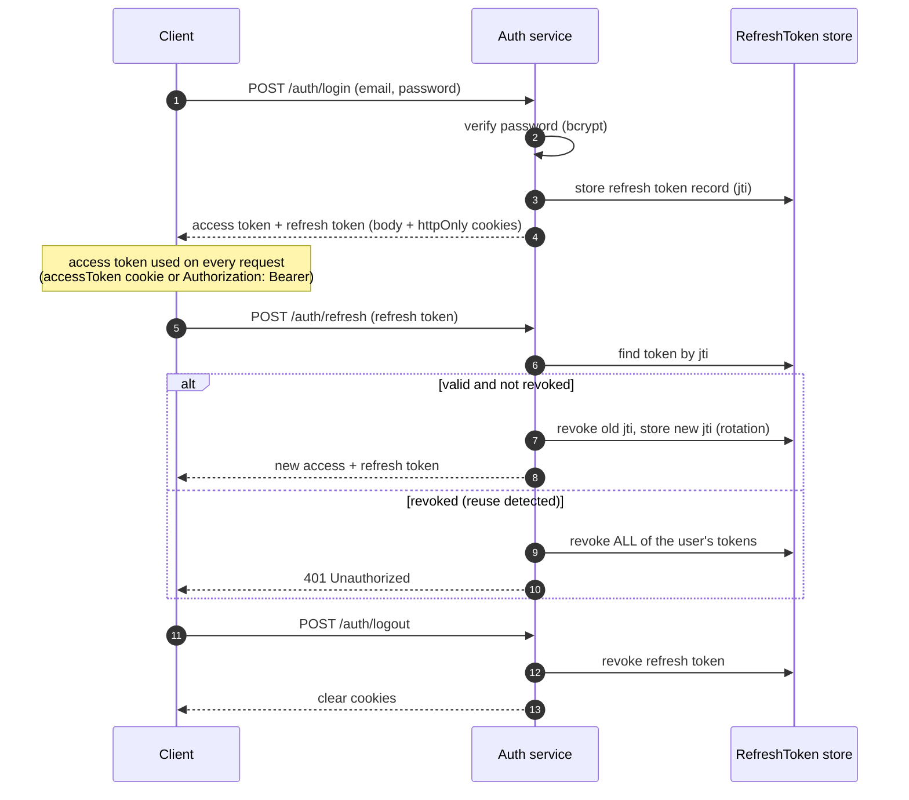
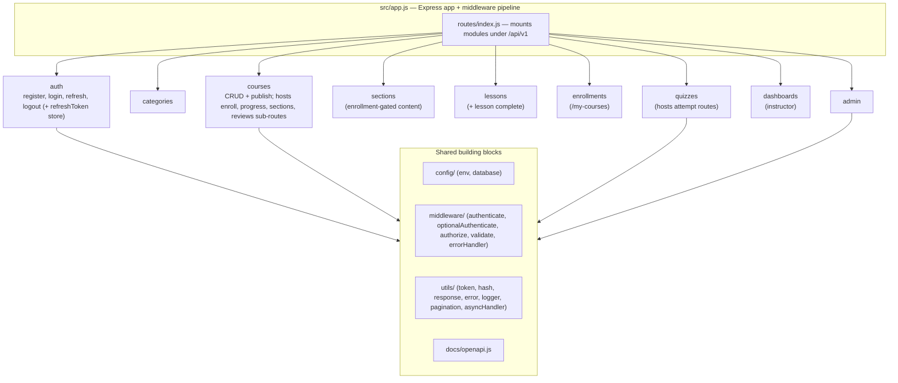

# Architecture — Online Learning Platform (Backend)

This document describes the backend architecture: the layered structure, the request lifecycle, the middleware pipeline, and the authentication flow. The repository is currently **backend-only**; a frontend will be built separately and will consume this REST API. All diagrams use Mermaid and render on GitHub.

## 1. Tech stack

- **Runtime:** Node.js + Express (plain JavaScript, CommonJS)
- **Database:** MongoDB via Mongoose
- **Auth:** JWT access + refresh tokens (refresh tokens are stored in the DB and rotated), bcrypt password hashing
- **Validation:** Joi
- **Security:** helmet, cors, express-rate-limit, httpOnly cookies
- **Docs:** Swagger / OpenAPI (`/api-docs`), Postman collection
- **Tests:** Jest + Supertest + mongodb-memory-server

## 2. High-level system context

## 3. Layered architecture

A request flows down through the layers; only the repository layer talks to the database, and business logic lives only in services.

**Rules enforced by this design**

- Business logic never lives in routes or controllers — only in services.
- Only repositories/models touch the database.
- Controllers are thin and wrapped in `asyncHandler`, so thrown errors flow to one central error handler.
- Errors are thrown as typed classes (`BadRequestError` 400, `UnauthorizedError` 401, `ForbiddenError` 403, `NotFoundError` 404, `ConflictError` 409).
- Every response uses the standard envelope: `{ success, message, data, meta? }`.

## 4. Request lifecycle

Example: an enrolled student submits a quiz attempt (`POST /api/v1/quizzes/:id/attempts`).

### Enrollment-gated content

`GET /api/v1/courses/:id/sections` uses **optional authentication**: the lesson outline (titles, order, whether a quiz exists) is public, but each lesson's `videoUrl` and quiz are included only when the requester is an **enrolled student, the owner instructor, or an admin**.

## 5. Authentication & token flow

Access tokens are short-lived; refresh tokens are long-lived, stored in the database, rotated on every use, and revocable. Passwords are bcrypt-hashed.

## 6. Module map

Each feature is a self-contained module using the `<module>.<layer>.js` convention.

Supporting model/helper modules referenced by the features above: `users`, `progress`, `questions`, `quizAttempts`, `reviews`.

## 7. Cross-cutting concerns

| Concern | Where it lives |
|---------|----------------|
| Security headers | `helmet` (app-level) |
| CORS (allow-list + credentials) | `cors` (app-level, `CORS_ORIGIN`) |
| Rate limiting | `express-rate-limit` (global on `/api/v1`, stricter on `/api/v1/auth`) |
| Authentication | `middleware/authenticate.js` (verifies access token) |
| Optional authentication | `middleware/optionalAuthenticate.js` (used for gated public reads) |
| Authorization (RBAC) | `middleware/authorize.js` (`authorize(...roles)`) |
| Request validation | `middleware/validate.js` (Joi schemas per module) |
| Error handling | `middleware/errorHandler.js` + `utils/error.js` |
| Responses | `utils/response.js` (`sendSuccess` / `sendError`, with optional `meta`) |
| Pagination & search | `utils/pagination.js` |
| Logging | `utils/logger.js` (file-based: `logs/app.log` / `logs/error.log`) |
| API docs | `docs/openapi.js` served at `/api-docs` |

## 8. Domain rules (enforced in services)

- Only **published** courses can be enrolled in; duplicate enrollment is prevented.
- **Course creation** is instructor-only; **update / publish / delete** are owner-instructor-or-admin. Deleting a course cascades to its sections, lessons, quizzes, questions, attempts, enrollments, progress and reviews.
- **Category creation** is admin-only.
- **Lesson content** (`videoUrl`) and **quiz access** require enrollment (or course ownership / admin).
- **Quiz scoring** is performed on the server; attempt limits are enforced and the best score is kept; `correctAnswer` is never exposed to students.
- **Reviews** are rating-only (1–5), by enrolled students, one per course, updatable/deletable by the owner; the list returns an aggregated average.
- **Progress** is computed from completed required lessons plus passed quizzes; enrollment flips to `completed` at 100%.

## 9. Data layer

The full entity model, relationships, and the ER diagram are documented in [Database_design.md](Database_design.md). In short: `User`, `Category`, `Course → Section → Lesson`, `Quiz → Question`, `Enrollment`, `Progress`, `QuizAttempt`, `Review`, and `RefreshToken`. References always live on the child pointing up to its parent.
