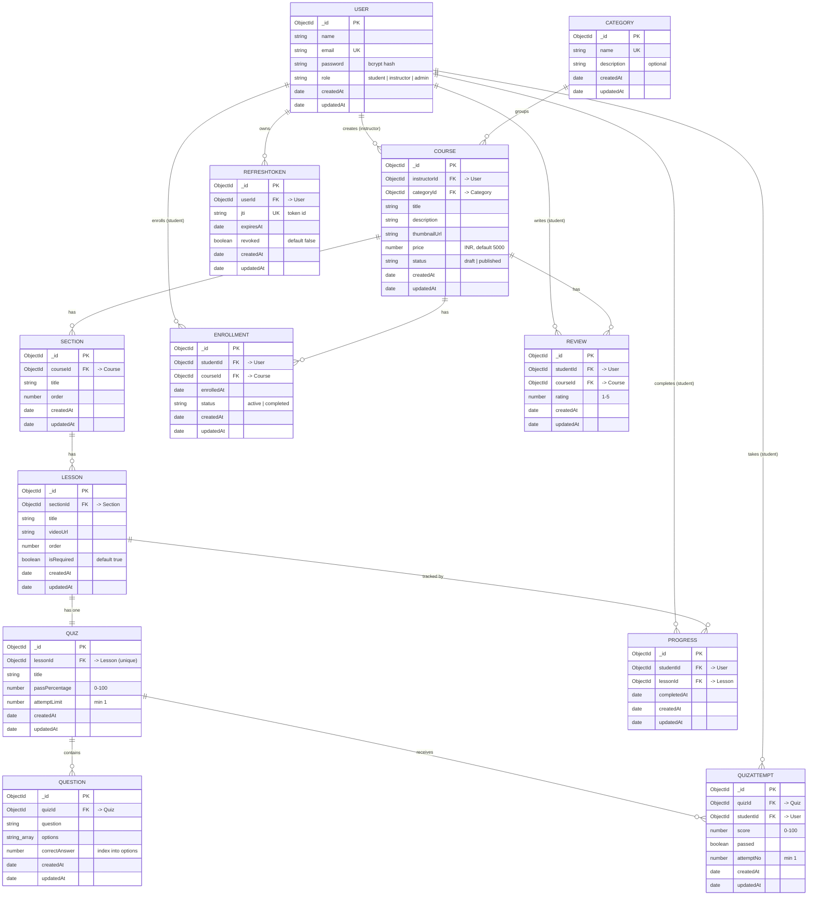

# Database Design — Online Learning Platform

This document describes the MongoDB (Mongoose) data model. It follows the entities and relationships defined in the project requirement document, plus a `RefreshToken` collection added for secure authentication (rotating, revocable refresh tokens).

- Database: MongoDB
- ODM: Mongoose
- Every collection has automatic `createdAt` and `updatedAt` timestamps.
- References use `ObjectId` links; the reference always lives on the child pointing up to its parent.

## Entities Overview

| Entity | Purpose |
|--------|---------|
| User | Students, instructors and admins |
| Category | Course categories (managed by admin) |
| Course | A course created by an instructor |
| Section | A chapter/group of lessons inside a course |
| Lesson | A single video lesson inside a section |
| Enrollment | A student enrolled in a course |
| Progress | A record that a student completed a lesson |
| Quiz | A quiz attached to a lesson |
| Question | A question that belongs to a quiz |
| QuizAttempt | A student's attempt at a quiz |
| Review | A student's review of a course |
| RefreshToken | A stored, rotating refresh token for a user session |

## ER Diagram

The diagram below renders automatically on GitHub (Mermaid). It shows every collection, its key fields, and the relationships with cardinality. `PK` = primary key, `FK` = foreign key (ObjectId reference), `UK` = unique key.



### Text fallback (for viewers without Mermaid)

```
User (instructor) ─< Course >─ Category
                       │
                       └─< Section ─< Lesson ─|| Quiz ─< Question
                                        │            │
                                        │            └─< QuizAttempt >─ User (student)
                                        │
User (student) ─< Enrollment >─ Course
User (student) ─< Progress >─ Lesson
User (student) ─< Review >─ Course
User            ─< RefreshToken

Legend:  ─<  one-to-many        ─||  one-to-one
```

## Relationships

- A User (instructor) can create many Courses.
- A Category can group many Courses.
- A Course belongs to one instructor and one category.
- A Course has many Sections; a Section has many Lessons (nested Course → Section → Lesson).
- A Lesson has exactly one Quiz (one-to-one; `Quiz.lessonId` is unique).
- A Quiz has many Questions and many QuizAttempts.
- A Student can enroll in many Courses, with one Enrollment per Course (no duplicates).
- A Student has one Progress record per Lesson.
- A Student has one Review per Course; a Course has many Reviews.
- A User can have many RefreshTokens over time (one active per session; rotated on refresh, revoked on logout).

Cardinality is enforced by unique/compound indexes (see the Indexes section).

## Collections

### User
| Field | Type | Rules |
|-------|------|-------|
| name | String | required |
| email | String | required, unique, lowercase |
| password | String | required (stored as bcrypt hash) |
| role | String | enum: student, instructor, admin (default student) |

### Category
| Field | Type | Rules |
|-------|------|-------|
| name | String | required, unique |
| description | String | optional |

### Course
| Field | Type | Rules |
|-------|------|-------|
| instructorId | ObjectId → User | required, indexed |
| categoryId | ObjectId → Category | required, indexed |
| title | String | required |
| description | String | required |
| thumbnailUrl | String | required (validated as an http/https URL) |
| price | Number | required, min 0, default 5000 (enrollment fee in ₹ INR; no payment is processed) |
| status | String | enum: draft, published (default draft), indexed |

### Section
| Field | Type | Rules |
|-------|------|-------|
| courseId | ObjectId → Course | required, indexed |
| title | String | required |
| order | Number | required |

### Lesson
| Field | Type | Rules |
|-------|------|-------|
| sectionId | ObjectId → Section | required, indexed |
| title | String | required |
| videoUrl | String | required |
| order | Number | required |
| isRequired | Boolean | default true |

### Enrollment
| Field | Type | Rules |
|-------|------|-------|
| studentId | ObjectId → User | required |
| courseId | ObjectId → Course | required |
| enrolledAt | Date | default now |
| status | String | enum: active, completed (default active) |

Unique compound index on (studentId, courseId) prevents duplicate enrollment.

### Progress
| Field | Type | Rules |
|-------|------|-------|
| studentId | ObjectId → User | required |
| lessonId | ObjectId → Lesson | required |
| completedAt | Date | default now |

Unique compound index on (studentId, lessonId) prevents duplicate completion. A student's per-course progress is calculated by counting completed required lessons and passed quizzes against the course's total required items.

### Quiz
| Field | Type | Rules |
|-------|------|-------|
| lessonId | ObjectId → Lesson | required, unique (one quiz per lesson) |
| title | String | required |
| passPercentage | Number | required, 0 to 100 |
| attemptLimit | Number | required, min 1 |

### Question
| Field | Type | Rules |
|-------|------|-------|
| quizId | ObjectId → Quiz | required, indexed |
| question | String | required |
| options | [String] | required |
| correctAnswer | Number | required (index into the options array) |

The correct answer is stored as the index of the correct option so scoring can be done on the server without exposing the answer to the client.

### QuizAttempt
| Field | Type | Rules |
|-------|------|-------|
| quizId | ObjectId → Quiz | required, indexed |
| studentId | ObjectId → User | required, indexed |
| score | Number | required |
| passed | Boolean | required |
| attemptNo | Number | required, min 1 |

### Review
| Field | Type | Rules |
|-------|------|-------|
| studentId | ObjectId → User | required |
| courseId | ObjectId → Course | required |
| rating | Number | required, 1 to 5 |

Reviews are rating-only (no free-text comment). Unique compound index on (studentId, courseId) enforces one rating per student per course. An enrolled student can add, update and delete their own rating; the list endpoint returns the average rating, total and a paginated list.

### RefreshToken
| Field | Type | Rules |
|-------|------|-------|
| userId | ObjectId → User | required, indexed |
| jti | String | required, unique (refresh token id) |
| expiresAt | Date | required |
| revoked | Boolean | default false |

Supports secure auth: on `/auth/refresh` the stored record is checked (not revoked, not expired), revoked (rotation) and replaced. Presenting an already-revoked token triggers reuse detection and revokes all of the user's refresh tokens. Logout revokes the presented token.

## Indexes

| Collection | Index | Type | Purpose |
|------------|-------|------|---------|
| User | email | unique | Prevent duplicate accounts; fast login lookup |
| Category | name | unique | Prevent duplicate categories |
| Course | instructorId | single | Filter courses by instructor |
| Course | categoryId | single | Filter courses by category |
| Course | status | single | Filter by draft/published |
| Section | courseId | single | Fetch sections of a course |
| Lesson | sectionId | single | Fetch lessons of a section |
| Enrollment | (studentId, courseId) | unique compound | Prevent duplicate enrollment |
| Progress | (studentId, lessonId) | unique compound | Prevent duplicate completion |
| Quiz | lessonId | unique | One quiz per lesson |
| Question | quizId | single | Fetch questions of a quiz |
| QuizAttempt | quizId, studentId | single | Fetch attempts by quiz/student |
| Review | (studentId, courseId) | unique compound | One review per student per course |
| RefreshToken | userId | single | Fetch/revoke a user's tokens |
| RefreshToken | jti | unique | Look up a specific refresh token |

## Design Notes

- Course content is nested as Course → Section → Lesson, as required by the specification.
- A Quiz is attached to a Lesson (one quiz per lesson); course-level quiz access is resolved by walking Lesson → Section → Course.
- The reference always lives on the child pointing up to the parent. A course's lessons are read through its sections (or virtuals), never stored as an array on the course.
- Correct answers live only on the server (`Question.correctAnswer`) and are stripped from the student-facing quiz payload, so quiz scoring cannot be tampered with by the client.
- Indexes are added on frequently filtered fields and as unique constraints wherever duplicates must be prevented.
